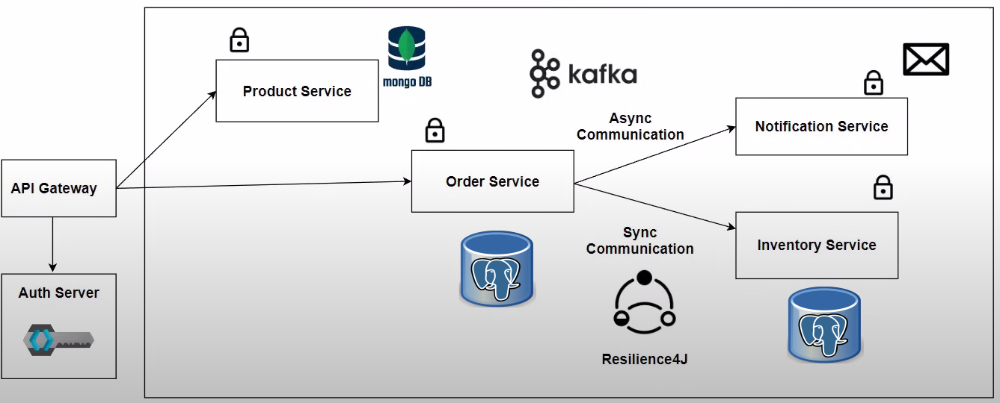

# Shopping 

Die Modellierung einer Online-Shopping-Plattform, die auf verschiedenen Servern läuft und Microservices verwendet, 
ermöglicht eine skalierbare und flexible Architektur, die es ermöglicht, verschiedene Teile der Anwendung unabhängig 
voneinander zu entwickeln, bereitzustellen und zu skalieren.

## Technologies Used 
- Spring Web MVC
- Spring Web Flux
- Lombok
- MongoDb
- PostgreSQL
- Keycloak
- Oauth2
- Spring Security
- Gateway-MVC
- Spring Cloud Circuit Breaker (Resilience4j)
- Sleuth & Zipkin
- apache kafka
- Actuator
- Prometheus
- Grafana
- Docker
- JUnit, Mockito und Testcontainers

#### Obwohl dieses Projekt nur zur Modellierung dient, demonstriert es meine umfassende Kompetenz in den angewandten Technologien und meine Fähigkeit, sie erfolgreich einzusetzen. Diese erworbenen Kenntnisse sind vielseitig einsetzbar und können problemlos in zukünftigen Projekten angewendet werden.

## Beschreibung
 - Das Projekt nutzt **Spring Boot** in Verbindung mit **Spring Web MVC** und **Spring WebFlux**. Dadurch ermöglicht es die Entwicklung sowohl traditioneller synchronisierter Webanwendungen als auch reaktiver, nicht blockierender Webanwendungen. Diese Kombination adressiert unterschiedliche Anforderungen an Leistung und Skalierbarkeit.
 - **Lombok** hat mir geholfen, weniger Code zu schreiben, indem es das Hinzufügen von Getter, Setter und anderen Boilerplate-Methoden automatisiert und dadurch die Entwicklung von Java-Anwendungen effizienter gestaltet.
 - Ich habe von beiden Datenbankmanagementsystemen, **MongoDB und PostgreSQL**, nur die Vorteile genutzt, um eine robuste und skalierbare Datenhaltung für meine Anwendung zu gewährleisten.
 - Die Integration von **Keycloak** ermöglicht eine einfache Implementierung von Sicherheitsfunktionen wie Authentifizierung und Autorisierung. Dadurch wurde sichergestellt, dass nur autorisierte Benutzer auf geschützte Ressourcen zugreifen können, und komplexe Sicherheitsanforderungen effizient umgesetzt wird.
 - Die Verwendung von **OAuth 2.0** in Verbindung mit **Spring Security** hat mir erlaubt, eine sichere und zuverlässige Authentifizierung und Autorisierung in meiner Anwendung zu implementieren.
 - Das **Gateway** ermöglicht eine effiziente und flexible Weiterleitung von eingehenden Anfragen an entsprechende Dienste, um eine nahtlose Kommunikation zwischen Client und Backend-Microservices sicherzustellen.
 - Die Verwendung von **Spring Cloud Circuit Breaker mit Resilience4j** hat mir geholfen, eine zuverlässige und widerstandsfähige Anwendung zu entwickeln, indem automatisch Ausfälle in externen Diensten erkannt und durch geeignete Strategien wie Fallbacks oder Zeitüberschreitungen behandelt wurden.
 - Die Integration von **Spring Cloud Sleuth mit Zipkin** ermöglicht eine effiziente Nachverfolgung von Anfragen über verteilte Systeme hinweg, indem Tracing-Informationen erfasst und in einem zentralen Dashboard visualisiert werden, wodurch Entwicklern Einblicke in die Leistung und Interaktionen ihrer Anwendung gewährt werden.
 - Die Verwendung von **Apache Kafka** ermöglicht eine hoch skalierbare, robuste und fehlertolerante Datenstromverarbeitung und Nachrichtenwarteschlangenlösung, die es Entwicklern ermöglicht, Daten in Echtzeit zwischen verschiedenen Anwendungen und Systemen zu verteilen und zu verarbeiten.
 - Die Kombination von Spring Boot **Actuator** mit **Prometheus** und **Grafana** ermöglicht eine umfassende Überwachung und Visualisierung der Leistung und Gesundheit einer Anwendung, indem Metriken und Überwachungsdaten gesammelt, gespeichert und grafisch dargestellt werden, wodurch Entwicklern Einblicke in die Leistung und Verfügbarkeit ihrer Anwendung gewährt werden.
 - Die Verwendung von **Docker** ermöglicht eine effiziente Erstellung, Bereitstellung und Ausführung von Anwendungen in Containern, wodurch Entwickler eine konsistente Umgebung für ihre Anwendungen schaffen können, unabhängig von der zugrunde liegenden Infrastruktur.
 - Die Integration von **JUnit, Mockito und Testcontainers** ermöglicht eine umfassende und zuverlässige Testabdeckung für Anwendungen, indem Entwickler automatisierte Tests für verschiedene Komponenten und Szenarien erstellen können, um die Funktionalität, Zuverlässigkeit und Leistung ihrer Anwendungen sicherzustellen.

